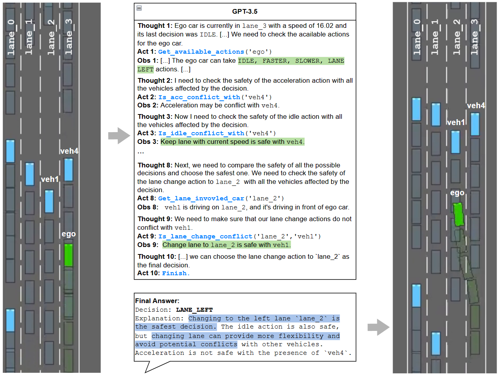

# Drive Like A Human

[](https://github.com/PJLab-ADG/DriveLikeAHuman/blob/main/assets/Driving_Like_Human.pdf)
[](https://huggingface.co/spaces/Wayne-lc/drive_like_human)
[
]()


Drive Like a Human: Rethinking Autonomous Driving with Large Language Models

NEWS: Try out our web demo on   [Hugging face🤗](https://huggingface.co/spaces/Wayne-lc/drive_like_human) without any deployment!

## Closed-loop interaction ability in driving scenarios

https://github.com/PJLab-ADG/DriveLikeAHuman/assets/18390668/0ec8e901-9dc1-4c89-81d6-994309a49630


Running `HELLM.py` allows you to experience LLM’s closed-loop driving in HighwayEnv. First, you need to modify config.yaml to configure your LLM.

```yaml
OPENAI_API_TYPE: 'azure' #'azure'  OR 'openai'
# for 'openai'
OPENAI_KEY: 'sk-xxxxxxxxxxx' # your openai key
# for 'azure'
AZURE_MODEL: 'XXXXX' # your deploment_model_name 
AZURE_API_BASE: https://xxxxxxxx.openai.azure.com/ # your deployment endpoint
AZURE_API_KEY: 'xxxxxx' # your deployment key
AZURE_API_VERSION: '2023-03-15-preview'
```

We use GPT-3.5 (**recommended the models with 8k+ max token**) as the default LLM, but you can also refer to [LangChain-Large Language Models](https://python.langchain.com/docs/modules/model_io/models/) to define your own LLM. In this case, you need to modify lines 24-40 of `HELLM.py` to configure your own LLM.

```Python
if OPENAI_CONFIG['OPENAI_API_TYPE'] == 'azure':
    os.environ["OPENAI_API_TYPE"] = OPENAI_CONFIG['OPENAI_API_TYPE']
    os.environ["OPENAI_API_VERSION"] = OPENAI_CONFIG['AZURE_API_VERSION']
    os.environ["OPENAI_API_BASE"] = OPENAI_CONFIG['AZURE_API_BASE']
    os.environ["OPENAI_API_KEY"] = OPENAI_CONFIG['AZURE_API_KEY']
    llm = AzureChatOpenAI(
        deployment_name=OPENAI_CONFIG['AZURE_MODEL'],
        temperature=0,
        max_tokens=1024,
        request_timeout=60
    )
elif OPENAI_CONFIG['OPENAI_API_TYPE'] == 'openai':
    os.environ["OPENAI_API_KEY"] = OPENAI_CONFIG['OPENAI_KEY']
    llm = ChatOpenAI(
        temperature=0,
        model_name='gpt-3.5-turbo-16k-0613', # or any other model with 8k+ context
        max_tokens=1024,
        request_timeout=60
    )
```

Then, by running `python HELLM.py`, you can see the process of LLM making decisions using tools.




## Reasoning ability with common sense

Try it with your own image in  [Hugging face🤗](https://huggingface.co/spaces/Wayne-lc/drive_like_human) or deploy your own with [this notebook](CaseReasoning.ipynb)!


## Performance enhancement through memorization ability


## Cite
```
@misc{fu2023drive,
      title={Drive Like a Human: Rethinking Autonomous Driving with Large Language Models}, 
      author={Daocheng Fu and Xin Li and Licheng Wen and Min Dou and Pinlong Cai and Botian Shi},
      year={2023}, 
      howpublished = {\url{https://github.com/PJLab-ADG/DriveLikeAHuman}},
}
```

## Acknowledgments

We would like to thank the authors and developers of the following projects, this project is built upon these great open-sourced projects.
- [highway-env](https://github.com/Farama-Foundation/HighwayEnv)
- [LangChain](https://github.com/hwchase17/langchain)
- [LLaMA-Adapter](https://github.com/OpenGVLab/LLaMA-Adapter)

## Contact

- If you have any questions, please report issues on GitHub.
